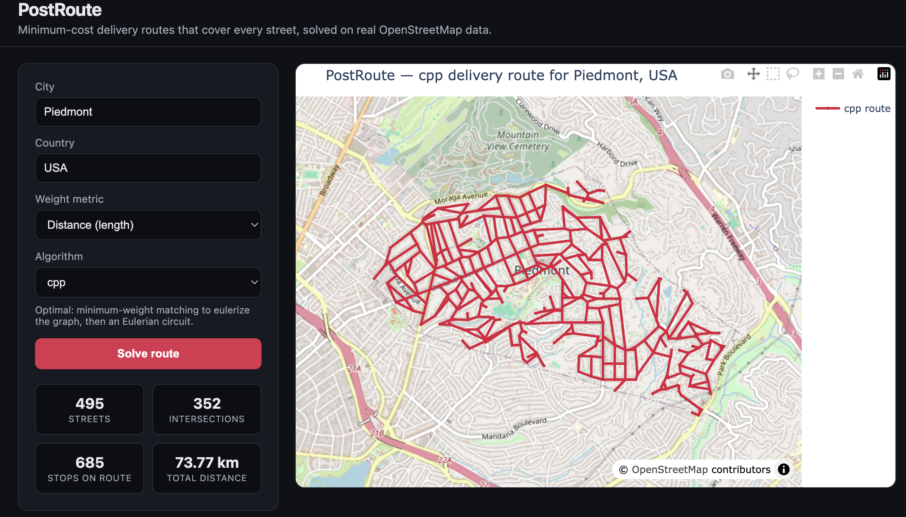

# PostRoute

Every street in a city, covered in one loop, at the shortest total distance possible. That's the problem PostRoute solves: given a real city's street map, it works out the cheapest route a postal carrier could drive to pass down every single street at least once and end up back where they started.

It's a hands-on implementation of the **Chinese Postman Problem** (also called the Route Inspection Problem), a classic piece of graph theory that shows up anywhere someone has to *cover* a network rather than just get from A to B: snow plows, street sweepers, garbage trucks, meter readers, mail carriers. PostRoute applies it to the last one, on real OpenStreetMap street data, with a live web UI to watch it solve.

**Try it live:** [postroute-21bz.onrender.com](https://postroute-21bz.onrender.com) *(free-tier hosting, sleeps after 15 minutes idle; first request after that takes ~30-50s to wake back up)*



## How it works

A city's streets form a graph: intersections are nodes, streets are weighted edges. To drive down every edge and get back to the start in one continuous loop, every intersection needs an *even* number of streets meeting at it (you always arrive down one and leave down another). Real cities are full of intersections that break this rule (dead ends, three-way junctions), so the graph first has to be made "Eulerian" by duplicating some streets, effectively driving down them twice.

The trick is picking *which* streets to duplicate as cheaply as possible. PostRoute pairs up every odd intersection with another one via a minimum-weight matching, then finds the shortest path between each pair and duplicates the streets along it. Get that pairing right and you've found the shortest possible route that covers everything.

Four ways to solve it, picked from the algorithm dropdown:

- **`cpp`** is the real thing: exact minimum-weight matching between odd intersections for small-to-mid-size areas, falling back to matching each one against only its 10 nearest odd neighbors once there are too many to pair exhaustively (matching cost grows roughly cubically with the number of odd intersections, so an exact search that's instant for a small town becomes genuinely intractable for a large metro).
- **`fleury`** is the textbook algorithm for walking an Eulerian graph without accidentally stranding yourself on the wrong side of a bridge. Same cost as `cpp`, different walk.
- **`dfs` / `bfs`** do no matching at all, just a greedy walk that backtracks via the nearest unfinished street when it runs out of road. Non-optimal, but stays fast no matter how big the city gets.

Solving happens on a background thread while the page polls for progress, so the UI shows a real 0-100% progress bar and a live log of what's happening stage by stage, not a spinner with no idea whether it's working or stuck.

## Setup

```
pip install -r requirements.txt
python app.py
```

Open `http://localhost:5050`, type a city, pick an algorithm, hit **Solve route**.

Prefer a terminal? The same solver runs as a CLI:

```
python script.py --city "Le Plateau-Mont-Royal" --country Canada --algorithm cpp
```

`--weight_name` switches between optimizing `length` (distance, default) or `travel_time`. `--osm-file` loads a local `.osm` extract instead of downloading live, useful for a whole metro area where a single Overpass query would be slow (get one from [bbbike.org](https://extract.bbbike.org/), or a Geofabrik `.osm.pbf` converted with `osmium cat -f osm in.pbf -o out.osm`).

## License

MIT. See [LICENSE](LICENSE).
